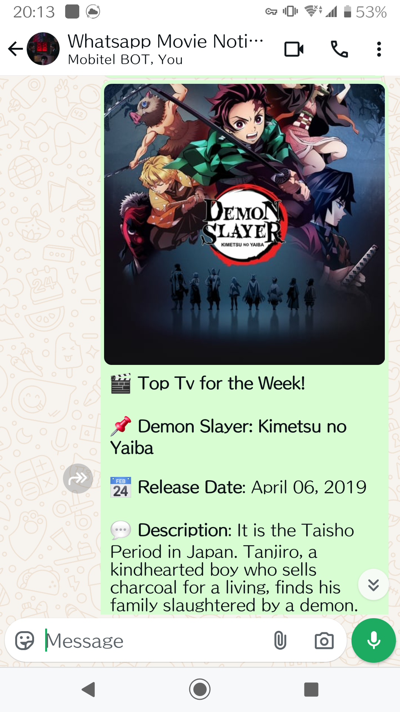

# WhatsApp Movie Notifier

Welcome to the **WhatsApp Movie Notifier**! 🎬🍿

Are you a movie buff who can't wait to know about the latest releases? Do you want to impress your friends with your up-to-date movie knowledge? Or maybe you just want to have a cool project to show off? Well, you're in the right place!

## What Does This Project Do?

This nifty little script fetches the latest movies from The Movie Database (TMDB) and sends a WhatsApp message with the details. Yes, you heard that right! Your WhatsApp will be buzzing with the latest movie updates, complete with posters and descriptions. How cool is that? Now you can be the movie guru in your group chat!

Here's a screenshot of what the notification looks like:



## How to Get Started

### Prerequisites

Before you dive in, make sure you have the following:

1. **Python**: Because, well, this is a Python script. 🐍
2. **Requests Library**: To make HTTP requests. Install it using `pip install requests`.
3. **Dotenv Library**: To manage environment variables. Install it using `pip install python-dotenv`.
4. **TMDB API Key**: Sign up at [TMDB](https://www.themoviedb.org/) and get your API key. Don't worry, it's free!
5. **Green API Account**: Sign up at [Green API](https://green-api.com/) to send WhatsApp messages. Because who doesn't love green?

### Setup

1. **Clone the Repository**:
    ```bash
    git clone https://github.com/sh13y/whatsapp-movie-notifier.git
    cd whatsapp-movie-notifier
    ```

2. **Create a `.env` File**:
    Create a `.env` file in the root directory and add your API keys and WhatsApp number:
    ```
    API_URL=https://api.green-api.com
    GREEN_API_INSTANCE_ID=your_instance_id
    GREEN_API_API_TOKEN=your_api_token
    WHATSAPP_NUMBER=your_whatsapp_number_with_country_code
    TMDB_API_KEY=your_tmdb_api_key
    ```

3. **Run the Script**:
    ```bash
    python main.py
    ```

## How It Works

1. **Fetch Latest Movies**: The script fetches the latest movies from TMDB. It's like having a personal movie assistant!
2. **Format the Data**: It formats the movie details into a nice, readable message. No more boring text!
3. **Send WhatsApp Notification**: It sends the message (with a poster image) to your WhatsApp using Green API. Your friends will think you're a movie insider!

## Troubleshooting

- **No Movies Found**: If no movies are found, make sure your TMDB API key is correct and has the necessary permissions. Or maybe Hollywood is just having a slow week.
- **WhatsApp Notification Failed**: Check your Green API credentials and ensure your WhatsApp number is correct. Double-check those digits!

## Contributing

Feel free to fork this repository, make your changes, and submit a pull request. Contributions are always welcome! Just don't break anything, okay?

## License

This project is licensed under the WTFPL License. See the [LICENSE](LICENSE) file for details.

## Disclaimer

This project is for educational purposes only. Use it responsibly and don't spam your friends with movie updates (unless they really, really want them). Seriously, don't be that person.

---

Happy coding, and may your WhatsApp be ever filled with the latest movie buzz! 🎥✨